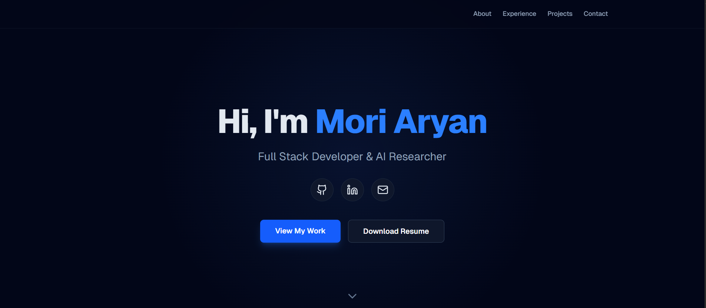

# 🌐 Portfolio Website

Personal developer portfolio showcasing my projects, skills, and work in software engineering and machine learning.

🔗 **Live Website:** https://moriaryan.vercel.app

---

## 📌 About

This portfolio website serves as a central place to explore my work, including full-stack applications, machine learning projects, and technical experiments.

It highlights my experience as a **Computer Science undergraduate at SVNIT Surat**, along with projects in **web development, applied machine learning, and software engineering**.

---

## 🚀 Features

- Project showcase with descriptions
- Skills and technology overview
- Responsive modern UI
- Fast performance using server-side rendering
- Clean navigation and minimal design

---

## 🛠 Tech Stack

- **Framework:** Next.js
- **Languages:** TypeScript, JavaScript
- **Styling:** Tailwind CSS
- **Deployment:** Vercel

---

## 📂 Project Structure
- app/ → Next.js app router pages
- components/ → reusable UI components
- public/ → static assets
- styles/ → styling configuration

## 🌐 Portfolio Website



---
## ⚡ Getting Started

Clone the repository:

```bash
git clone https://github.com/MoriAryan/Portfolio.git
cd Portfolio
//Install dependencies:
npm install
//Run the development server:
npm run dev
```
Open:
http://localhost:3000


